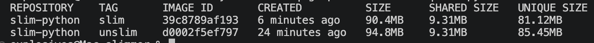

- **Build**: `docker build --build-arg APP_CMD="python3 -m http.server 8000" --build-arg HEALTHCHECK_CMD="wget -qO- http://localhost:8000 > /dev/null 2>&1" -t slim-python:unslim .`
- **Trace**: `docker run --rm -v alpine-vol:/mnt/data slim-python:unslim`
- Copy `used_files.txt` from the volume to your build directory

- **Build slimmer image**: `docker build -f Dockerfile-slim -t slim-python:slim .`
- **Run slimmer image**: `docker run --rm slim-python:slim`

--- 
- `docker system df -v | grep -E "REPOSITORY|slim-python"`
